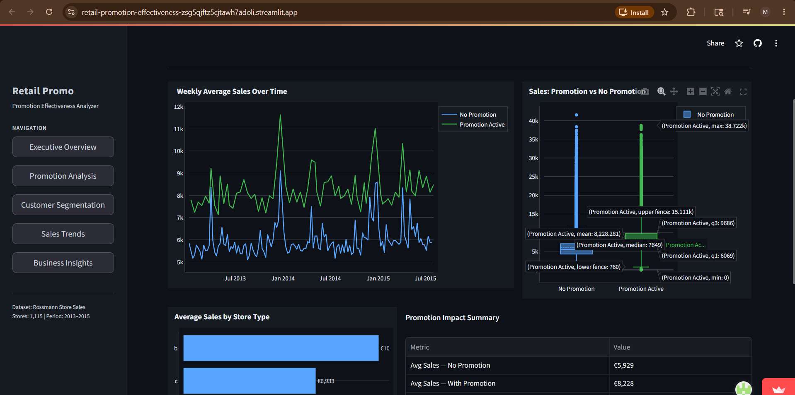
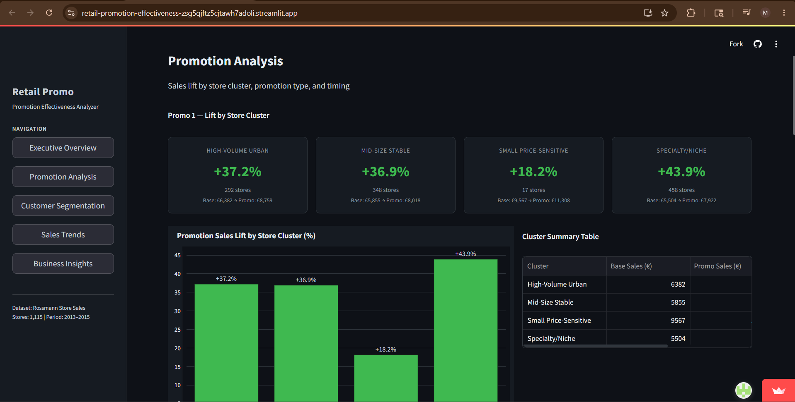
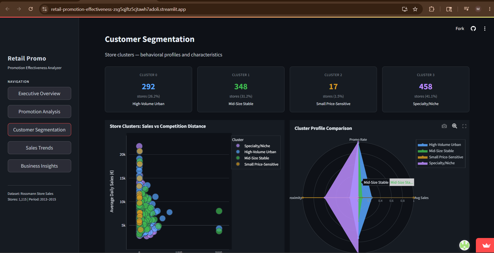
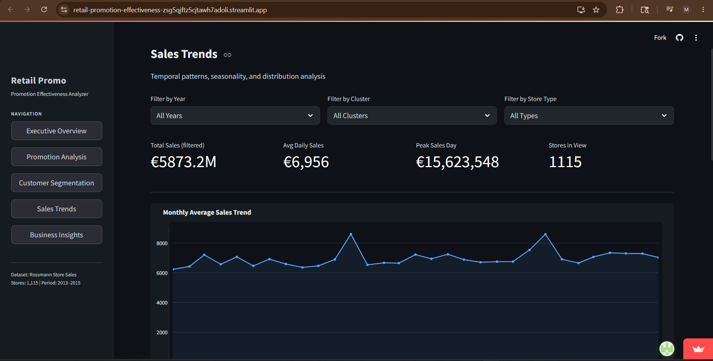

# Retail Promotion Effectiveness Analyzer

Most retailers measure promotion success with a single aggregated lift number. That number lies.  
The same promotion can drive strong incremental revenue in high-footfall urban stores while delivering 
zero or negative returns elsewhere — and averaging them together hides both.

This project identifies **where promotions actually work** across 1,115 Rossmann stores, separates 
genuine lift from seasonal noise, and surfaces data-driven recommendations on where to concentrate 
or redesign promotion spend.

---

## Dashboard

| | |
|---|---|
|  |  |
|  | |

🔗 **[Live Demo →](https://retail-promotion-effectiveness-zsg5qjftz5cjtawh7adoli.streamlit.app/)**

---

## What was done

- **Segmented 1,115 stores** into behavioural clusters (K-Means) using sales volume, volatility, 
  promotion rate, and competition distance — then measured promotion response *within* each segment
- **Isolated seasonal confounding** — promotions cluster in December peaks, causing raw lift to 
  overstate true promotion effect
- **Identified a structurally distinct cohort** of 17 Type B stores that behave differently enough 
  to need their own strategy
- **Built a 5-page Streamlit dashboard** for business stakeholders covering executive KPIs, 
  cluster-level lift, segmentation profiles, sales trends, and strategic recommendations

**Key result:** Overall raw lift is +38.8%, but this varies significantly by segment — 
the same budget, reallocated to high-response clusters, drives meaningfully more incremental revenue.

---

## Stack
`Python` · `Pandas` · `Scikit-learn` · `Plotly` · `Streamlit` · `PCA` · `K Means Clustering`  
Dataset: [Rossmann Store Sales — Kaggle]([https://www.kaggle.com/datasets/chakramlops/rossmann-store-sales-dataset/data])

---
